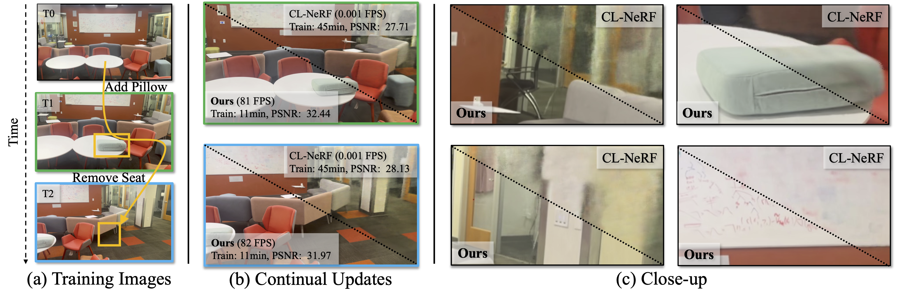

# CL-Splats: Continual Learning of Gaussian Splatting with Local Optimization

###  ICCV 2025
[](https://cl-splats.github.io/) [](https://arxiv.org/abs/2506.21117)


[Jan Ackermann](https://janackermann.info)
[Jonas Kulhanek](https://jkulhanek.com)
[Shengqu Cai](https://primecai.github.io)
[Haofei Xu](https://haofeixu.github.io)
[Marc Pollefeys](https://people.inf.ethz.ch/marc.pollefeys/)
[Gordon Wetzstein](https://stanford.edu/~gordonwz/)
[Leonidas Guibas](https://geometry.stanford.edu/?member=guibas)
[Songyou Peng](https://pengsongyou.github.io)



*TL;DR*: CL-Splats optimizes existing 3DGS scene representations with a small set of images showing the changed region.

## Contents
<!--ts-->
   * [Install](#install)
   * [Dataset Format](#dataset-format)
   * [Usage](#usage)
   * [Configuration](#configuration)
   * [Todos](#todos)
   * [Citation](#citation)
<!--te-->

## Install

### Pre-requisites
While not strictly necessary for using our method, COLMAP is necessary to obtain camera poses for the initial reconstruction as well as to add new observations to existing models.
Please follow the instructions on the COLMAP website to install COLMAP. If possible install it with CUDA support.

### Environment

We tested our code on Ubuntu 24.04 with CUDA 12.8, and verified the full pipeline on Debian with CUDA 12.4 (A100, torch 2.6.0+cu124, Python 3.13). Install via pip (we recommend a conda/venv environment):

```bash
# Create and activate environment
conda create -n cl-splats python=3.10
conda activate cl-splats

# Install the package with everything needed for training:
#   [train]  → transformers (Depth-Anything), torchmetrics, wandb
#   [gsplat] → gsplat rasterizer + ninja (for its CUDA JIT build)
pip install -e '.[train,gsplat]'
```

A bare `pip install -e .` installs only the core dependencies — enough for the unit tests, but **not** for training (`cl-splats-train` needs the `train` and `gsplat` extras).

> **Note — CUDA versions:**
> Your PyTorch wheel's CUDA version must be supported by your **NVIDIA driver**, and `nvcc` (CUDA Development Kit) must be on `PATH` with a matching version — gsplat compiles its CUDA kernels with `nvcc` on first use (one-time, ~2 min; it also needs `ninja`, installed by the `gsplat` extra). For example, on a CUDA 12.4 driver install a cu124 wheel:
>
> ```bash
> pip install torch torchvision --index-url https://download.pytorch.org/whl/cu124
> ```
>
> A wheel built for a newer CUDA than the driver supports (e.g. cu13x on a 12.4 driver) makes `torch.cuda.is_available()` return `False`.

## Data

The synthetic continual-learning benchmark (Blender Levels 1–3 with `add`/`delete`/`move`/`multi` changes) and the real-world scenes are hosted on HuggingFace at [`ackermannj/cl-splats-dataset`](https://huggingface.co/datasets/ackermannj/cl-splats-dataset):

```bash
# Example: download the Level-1 base scene + 'add' change (skips .blend/checkpoint files)
python -c "
from huggingface_hub import snapshot_download
snapshot_download('ackermannj/cl-splats-dataset', repo_type='dataset', local_dir='data',
                  allow_patterns=['Blender-Levels/Level-1/transforms_train.json',
                                  'Blender-Levels/Level-1/train/**',
                                  'Blender-Levels/Level-1/add/**'])
"

cl-splats-train --data-path data/Blender-Levels/Level-1 --change-type add --eval --white-background
```


## Dataset Format

CL-Splats supports two dataset formats, auto-detected at runtime.

### COLMAP (real-world scenes)

Standard COLMAP workspace layout — what `preprocessing.py` produces:

```text
path/to/dataset/
├── images/           # undistorted images
│   ├── frame_00001.jpg
│   └── ...
└── sparse/
    └── 0/
        ├── cameras.bin
        ├── images.bin
        └── points3D.bin
```

Run with:
```bash
cl-splats-train --data-path path/to/dataset
```

#### Computing Poses

For your convenience, we provide a preprocessing script that runs COLMAP automatically. It assumes raw images are organised as timestep folders:

```text
path/to/your/input/
├── t0/   # images for timestep 0 (base scene)
│   ├── *.{png,jpeg,jpg}
│   └── ...
├── t1/   # images for timestep 1 (after changes)
│   └── ...
└── ...
```

Run:
```bash
python3 clsplats/utils/preprocessing.py --input_dir <path/to/your/input>
```

> **Note:**  
> Our codebase currently only supports NeRF-Synthetic and COLMAP pose formats, and their naming scheme must be consistent with the output of our preprocessing script.

---

### Blender / NeRF-Synthetic (CL benchmark scenes)

Used for the synthetic continual-learning benchmark dataset. Each timestep lives in its own subdirectory with a `transforms_train.json` file:

```text
path/to/Level-1/
├── transforms_train.json   # base scene (t0)
├── images/
│   └── ...
└── add/                    # change subfolder named after the change type
    ├── transforms_train.json
    └── images/
        └── ...
```

Available change types: `add`, `delete`, `move`, `multi`.

Run with:
```bash
cl-splats-train --data-path path/to/Level-1 --change-type add
```


## Usage

### Basic Training

```bash
# Real-world COLMAP scene (single timestep)
cl-splats-train --data-path path/to/dataset

# Blender CL scene (base + one change timestep)
cl-splats-train --data-path path/to/Level-1 --change-type add
```

### CLI Reference

| Flag | Default | Description |
|---|---|---|
| `--data-path` / `-d` | `.` | Path to the dataset root directory |
| `--change-type` / `-c` | `None` | Change type for Blender CL datasets (`add`, `delete`, `move`, `multi`). Omit for COLMAP/single-timestep scenes. |
| `--images` | `images` | Name of the images subdirectory |
| `--eval` | `False` | Evaluate on a held-out test split after training |
| `--white-background` | `False` | Composite and render Blender scenes onto a white background (NeRF-Synthetic benchmark convention) |
| `--offline` / `--no-offline` | `False` | Disable all network access — sets `HF_HUB_OFFLINE=1`, `TRANSFORMERS_OFFLINE=1`, and forces W&B offline. Use when running without internet (e.g. air-gapped servers). |
| `--config-name` | `cl-splats` | Hydra config file to load from `configs/` (without `.yaml`) |

Run `cl-splats-train --help` to see all options.

### Overriding Config Values (Hydra)

Any configuration value can be overridden directly on the command line as positional arguments using Hydra dot-notation:

```bash
# More iterations, lower position learning rate
cl-splats-train --data-path path/to/dataset \
    train.iters_per_timestep=500 \
    train.position_lr_init=8e-5

# Tighter change-detection threshold with dilation
cl-splats-train --data-path path/to/Level-1 --change-type add \
    change.threshold=0.7 \
    change.dilate_mask=true \
    change.dilate_kernel_size=15

# Enable live W&B syncing
cl-splats-train --data-path path/to/dataset wandb_mode=online
```

### Output

Results are saved to `outputs/<run-name>/` by default and include:

- `gaussians_t<N>.ply` — Gaussian splat checkpoint at each trained timestep,  
  viewable in [SuperSplat](https://superspl.at/editor) or Luma AI
- `eval/t<N>/` — per-view rendered + GT images and console PSNR/SSIM when `--eval` is used
- W&B run logs (synced live, or stored offline for later upload)

### Evaluating on a Test Split

Pass `--eval` to hold out a test set (every 8th camera LLFF-style for COLMAP; `transforms_test.json` for Blender) and compute **PSNR** and **SSIM** after training each timestep:

```bash
cl-splats-train --data-path path/to/dataset --eval
```

Per-view metrics are printed to stdout and (if W&B is active) logged under `eval/t<timestep>/psnr` and `eval/t<timestep>/ssim`. Rendered images are saved to `outputs/eval/t<N>/`.

The evaluation uses **torchmetrics** when installed (`pip install 'torchmetrics[image]'`) and falls back to a pure-PyTorch SSIM/PSNR implementation otherwise.

### Standalone Evaluation (`cl-splats-eval`)

To evaluate a previously saved `.ply` checkpoint **without re-running training**, use the dedicated `cl-splats-eval` command:

```bash
# Evaluate a checkpoint on its dataset test split
cl-splats-eval \
    --ply outputs/gaussians_time_0001.ply \
    --data-path path/to/dataset

# Blender CL scene — evaluate at t=1 (change timestep)
cl-splats-eval \
    --ply outputs/gaussians_time_0001.ply \
    --data-path path/to/Level-1 \
    --change-type add \
    --timestep 1
```

**Flags:**

| Flag | Default | Description |
|---|---|---|
| `--ply` / `-p` | *(required)* | Path to the `.ply` Gaussian checkpoint |
| `--data-path` / `-d` | *(required)* | Dataset root directory |
| `--change-type` / `-c` | `None` | Change type for Blender CL datasets |
| `--timestep` / `-t` | `0` | Timestep the checkpoint corresponds to (for output naming) |
| `--out-dir` / `-o` | `outputs/eval` | Where to save rendered + GT images |
| `--images` | `images` | Images sub-folder (COLMAP only) |
| `--sh-degree` | `0` | SH degree used during training |

Rendered images are saved as `<out_dir>/t<N>/<name>_render.png` and `<name>_gt.png`. Metrics are printed to stdout.

### Recovering Past Scene States (`cl-splats-history`)

CL-Splats only optimises the Gaussians inside the changed region; the rest of the scene is frozen by construction. This makes every past timestep **exactly recoverable** from the final model plus a small per-timestep delta (the pre-update state of the changed Gaussians) — no need to store a full checkpoint per timestep.

Train with `history.log_history=true` to save the deltas to `outputs/history/`, then reconstruct any earlier timestep:

```bash
cl-splats-history \
    --ply outputs/gaussians_time_0001.ply \
    --history-dir outputs/history \
    --time 0 \
    --out outputs/gaussians_recovered_t0.ply
```

**Flags:**

| Flag | Default | Description |
|---|---|---|
| `--ply` / `-p` | *(required)* | Final `.ply` checkpoint (latest trained timestep) |
| `--history-dir` | `outputs/history` | Directory with the per-timestep history records |
| `--time` / `-t` | *(required)* | Timestep to recover (end-of-timestep state) |
| `--out` / `-o` | *(required)* | Output path for the recovered `.ply` |

The recovered checkpoint is bit-identical to the model as it existed at that timestep and can be evaluated with `cl-splats-eval` or opened in any 3DGS viewer.


## Configuration

The default config lives in `configs/cl-splats.yaml`. A summary of the most useful keys:

### `train`
| Key | Default | Description |
|---|---|---|
| `position_lr_init` | `1.6e-4` | Initial position learning rate (3DGS schedule, scaled by scene extent) |
| `iters_per_timestep` | `100` | Optimisation iterations per timestep |
| `num_times` | `1` | Number of timesteps (auto-set to `2` for Blender + `--change-type`) |
| `start_time` | `0` | First timestep index to optimise |

### `change` — DINOv2 change detection
| Key | Default | Description |
|---|---|---|
| `threshold` | `0.8` | Cosine-similarity threshold; lower = more sensitive |
| `dilate_mask` | `false` | Morphologically dilate the binary change mask |
| `dilate_kernel_size` | `31` | Dilation kernel size (pixels) |
| `upsample` | `true` | Upsample mask back to full image resolution |

### `lifter` — Depth-Anything V2 3D lifting
| Key | Default | Description |
|---|---|---|
| `depth_model` | `depth-anything/Depth-Anything-V2-Small-hf` | HuggingFace model ID |
| `k_nn` | `8` | Nearest Gaussian neighbours per back-projected pixel |
| `local_radius_thresh` | `2.5` | Max scale-normalised distance for a kNN match |
| `depth_tol_abs` | `0.05` | Absolute depth consistency tolerance (scene units) |
| `depth_tol_rel` | `0.05` | Relative depth consistency tolerance |
| `final_thresh` | `0.6` | Minimum score to activate a Gaussian for optimisation |

### `model` — Gaussian representation
| Key | Default | Description |
|---|---|---|
| `sh_degree` | `0` | Spherical harmonics degree (0 = colour only) |
| `init_scale` | `0.01` | Initial Gaussian scale |
| `init_opacity` | `0.1` | Initial Gaussian opacity |

### `constraints` — Geometry constraints
| Key | Default | Description |
|---|---|---|
| `prune_every` | `50` | Prune dead Gaussians every N iterations |
| `prune_dist_thresh` | `0.02` | Distance threshold for pruning |
| `lambda_bound` | `0.0` | Bounding-box constraint weight |


## Todos
I continue to release the missing modules required to replicate our method.

- [x] Release initial codebase with framework skeleton.
- [x] Release camera estimation script.
- [x] Release fast change detection module.
- [x] Release sampling module.
- [x] Release pruning module.
- [x] Release data.
- [x] ~~Release local-optimization CUDA kernels.~~
- [x] Verify codebase.
- [x] Release history recovery.

## Disclaimer

Parts of this public reimplementation were developed and verified with the help of Claude (Anthropic's AI coding assistant). While the pipeline has been tested end to end on the released benchmark data, discrepancies with the original paper implementation may exist. If you notice any, please reach out via the email listed on [my website](https://janackermann.info).

## Citation
```
@inproceedings{ackermann2025clsplats,
    author={Ackermann, Jan and Kulhanek, Jonas and Cai, Shengqu and Haofei, Xu and Pollefeys, Marc and Wetzstein, Gordon and Guibas, Leonidas and Peng, Songyou},
    title={CL-Splats: Continual Learning of Gaussian Splatting with Local Optimization},
    booktitle={Proceedings of the IEEE/CVF International Conference on Computer Vision (ICCV)},
    year={2025}
}
```
